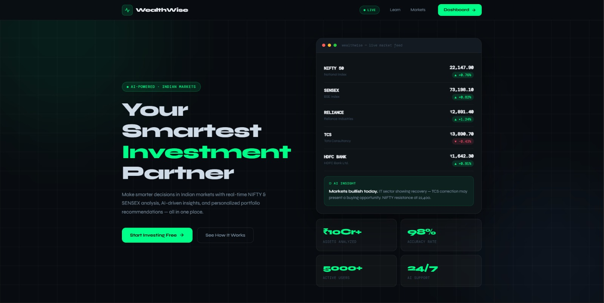
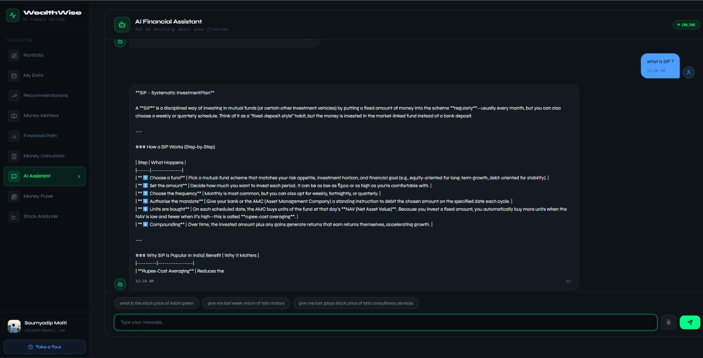
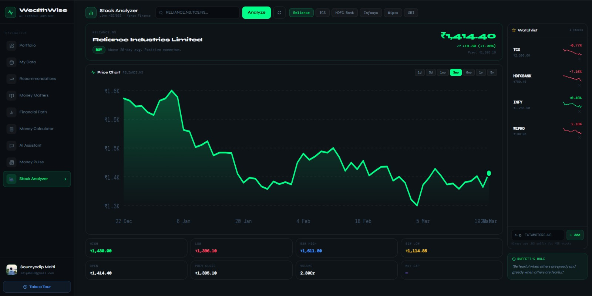
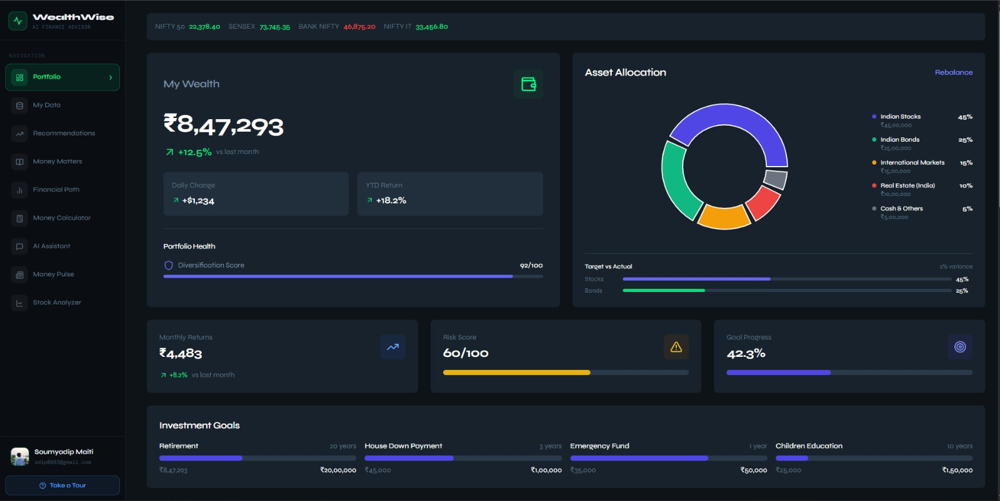
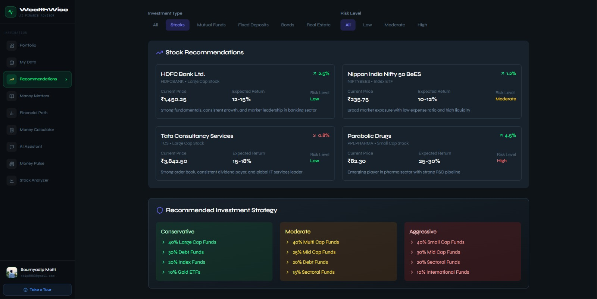

<div align="center">


# ◈ WealthWise
### *Your AI-Powered Investment Partner for Indian Markets*

[](https://reactjs.org/)
[](https://typescriptlang.org/)
[](https://python.org/)
[](https://flask.palletsprojects.com/)
[](https://openrouter.ai/)
[](https://vitejs.dev/)
[](https://tailwindcss.com/)
[](LICENSE)

<br/>

> **WealthWise** is a full-stack AI-powered personal finance platform built for Indian investors.  
> It combines real-time market data, intelligent portfolio tracking, and conversational AI  
> to help users make smarter financial decisions — all in one beautiful dark-themed dashboard.

<br/>


<br/>

[🚀 Live Demo](#) &nbsp;·&nbsp; [📖 Docs](#installation) &nbsp;·&nbsp; [🐛 Issues](../../issues) &nbsp;·&nbsp; [⭐ Star this repo](#)

</div>

---

## 📸 Screenshots

<div align="center">

| Landing Page | AI Chatbot |
|:---:|:---:|
|  |  |

| Stock Analyzer | Portfolio Dashboard |
|:---:|:---:|
|  |  |


*Financial Path Flow — AI-generated investment roadmap*

</div>

---

## ✨ Features

<table>
<tr>
<td width="50%">

### 🤖 AI Financial Advisor
- Conversational AI powered by **LLaMA / Nvidia Nemotron** via OpenRouter
- Context-aware chat with full conversation memory
- Voice input & text-to-speech output (Indian English)
- Specialized in Indian markets — NIFTY, SENSEX, SIP, PPF, NPS

</td>
<td width="50%">

### 📈 Live Stock Analyzer
- Real-time NSE/BSE stock data via **Yahoo Finance API**
- Interactive SVG price charts (1d / 5d / 1mo / 1y / 5y)
- AI-generated **BUY / SELL / HOLD** signals
- Personal watchlist with live sparklines
- Supports all Indian stocks with `.NS` / `.BO` suffix

</td>
</tr>
<tr>
<td width="50%">

### 🗺️ Financial Path Flow
- AI-generated **visual investment roadmap**
- Interactive node-based flow diagram (React Flow)
- Personalized based on user's risk profile
- Dynamic allocation across equity, debt, gold, real estate

</td>
<td width="50%">

### 📊 Smart Portfolio Dashboard
- Comprehensive holdings tracker
- Real-time P&L calculation
- Asset allocation breakdown
- Performance metrics and insights

</td>
</tr>
<tr>
<td width="50%">

### 📰 Money Pulse
- Curated financial news feed
- Real-time market updates
- Category filtering (Stocks, MF, Economy)
- Indian market focus

</td>
<td width="50%">

### 🧮 Money Calculator
- SIP return calculator
- Lump sum investment projector
- EMI calculator
- Goal-based planning tool

</td>
</tr>
<tr>
<td width="50%">

### 📚 Money Matters (Learn)
- Financial literacy resources
- Beginner to advanced content
- Indian market specific guides
- Interactive learning modules

</td>
<td width="50%">

### 🔐 Secure Authentication
- **Clerk** authentication (Google, GitHub, Email)
- Protected routes
- SSO callback support
- User profile management

</td>
</tr>
</table>

---

## 🏗️ Architecture

```
┌────────────────────────────────────────────────────────────────┐
│                        WealthWise                              │
│                                                                │
│  ┌──────────────────────┐      ┌──────────────────────────┐    │
│  │   FRONTEND (React)   │      │   BACKEND (Flask)        │    │
│  │                      │      │                          │    │
│  │  ┌────────────────┐  │      │  ┌────────────────────┐  │    │
│  │  │   Pages        │  │      │  │   Routes           │  │    │
│  │  │  • Home        │  │      │  │  • /agent          │  │    │
│  │  │  • Portfolio   │  │◄────►│  │  • /ai-fin-path    │  │    │
│  │  │  • Chatbot     │  │ API  │  │  • /auto-bank-data │  │    │
│  │  │  • Stock       │  │      │  │  • /auto-mf-data   │  │    │
│  │  │  • My Data     │  │      │  └────────────────────┘  │    │
│  │  │  • Learn       │  │      │                          │    │
│  │  │  • Fin Path    │  │      │  ┌────────────────────┐  │    │
│  │  │  • Money Calc  │  │      │  │   AI Modules       │  │    │
│  │  │  • MoneyPulse  │  │      │  │  • agent.py        │  │    │
│  │  └────────────────┘  │      │  │  • gemini_fin_path │  │    │
│  │                      │      │  │  • jgaad_backup    │  │    │
│  │  ┌────────────────┐  │      │  └────────────────────┘  │    │
│  │  │  Components    │  │      │                          │    │
│  │  │  • Sidebar     │  │      └──────────────────────────┘    │
│  │  │  • Navbar      │  │                   │                  │
│  │  │  • DashLayout  │  │                   │                  │
│  │  └────────────────┘  │      ┌────────────▼─────────────┐    │
│  │                      │      │    External APIs         │    │
│  │  ┌────────────────┐  │      │                          │    │
│  │  │  Context       │  │      │  • OpenRouter AI         │    │
│  │  │  • ThemeCtx    │  │      │    (Nvidia Nemotron)     │    │
│  │  │  • TourCtx     │  │      │  • Yahoo Finance API     │    │
│  │  └────────────────┘  │      │  • Clerk Auth            │    │
│  └──────────────────────┘      │  • Streamlit (Stock App) │    │
│                                └──────────────────────────┘    │
└────────────────────────────────────────────────────────────────┘
```

---

## 🛠️ Tech Stack

### Frontend
| Technology | Version | Purpose |
|---|---|---|
| **React** | 18.x | UI Framework |
| **TypeScript** | 5.x | Type Safety |
| **Vite** | 5.x | Build Tool |
| **Tailwind CSS** | 3.x | Styling |
| **React Router** | 6.x | Navigation |
| **Framer Motion** | 11.x | Animations |
| **Clerk** | Latest | Authentication |
| **Axios** | Latest | HTTP Client |
| **Lucide React** | Latest | Icons |
| **React Flow** | Latest | Flow Diagrams |
| **Recharts** | Latest | Data Charts |

### Backend
| Technology | Version | Purpose |
|---|---|---|
| **Python** | 3.11+ | Runtime |
| **Flask** | 3.x | Web Framework |
| **Flask-CORS** | Latest | Cross-Origin |
| **LangChain** | Latest | AI Orchestration |
| **OpenRouter API** | Latest | LLM Gateway |
| **Yahoo Finance** | Latest | Market Data |
| **python-dotenv** | Latest | Environment Vars |

### AI Models
| Model | Provider | Use Case |
|---|---|---|
| **nvidia/nemotron-3-nano-30b** | OpenRouter (Free) | Financial Chatbot |
| **liquid/lfm-2.5-1.2b** | OpenRouter (Free) | Backup AI |
| **Custom React Agent** | LangChain | Investment Research |

---

## 📁 Project Structure

```
WealthWise/
│
├── 📂 frontend/
│   ├── 📂 src/
│   │   ├── 📂 components/
│   │   │   ├── AuthComponent.tsx      # Clerk auth wrapper
│   │   │   ├── DashboardLayout.tsx    # Main dashboard shell
│   │   │   ├── DashboardTour.tsx      # Onboarding tour
│   │   │   ├── FinancialPathFlow.tsx  # React Flow diagram
│   │   │   ├── FullPageLoader.tsx     # Loading screen
│   │   │   ├── MoneyCalc.tsx          # Calculator widget
│   │   │   ├── MoneyPulse.tsx         # News feed
│   │   │   ├── Navbar.tsx             # Top navigation
│   │   │   ├── ProtectedRoute.tsx     # Auth guard
│   │   │   ├── Sidebar.tsx            # Side navigation
│   │   │   ├── SSOCallback.tsx        # OAuth callback
│   │   │   └── ThemeToggle.tsx        # Theme switcher
│   │   │
│   │   ├── 📂 pages/
│   │   │   ├── 📂 MyData/
│   │   │   │   ├── tabs/
│   │   │   │   │   ├── AssetsTab.tsx
│   │   │   │   │   ├── ExpensesTab.tsx
│   │   │   │   │   ├── GoalsTab.tsx
│   │   │   │   │   ├── IncomeTab.tsx
│   │   │   │   │   ├── LiabilitiesTab.tsx
│   │   │   │   │   └── RiskToleranceTab.tsx
│   │   │   │   └── index.tsx
│   │   │   ├── Chatbot.tsx            # AI chat interface
│   │   │   ├── Home.tsx               # Landing page
│   │   │   ├── Learn.tsx              # Education hub
│   │   │   ├── MarketAnalysis.tsx     # Market overview
│   │   │   ├── Portfolio.tsx          # Portfolio dashboard
│   │   │   ├── Profile.tsx            # User profile
│   │   │   ├── Recommendations.tsx    # AI recommendations
│   │   │   ├── SignIn.tsx             # Login page
│   │   │   ├── SignUp.tsx             # Register page
│   │   │   └── StockAnalyzer.tsx      # Live stock charts
│   │   │
│   │   ├── 📂 context/
│   │   │   ├── ThemeContext.tsx
│   │   │   └── TourContext.tsx
│   │   │
│   │   ├── App.jsx                    # Root component
│   │   ├── globals.css                # Global styles
│   │   ├── index.css                  # Tailwind imports
│   │   └── main.jsx                   # Entry point
│   │
│   ├── index.html
│   ├── package.json
│   ├── tailwind.config.js
│   └── vite.config.ts
│
├── 📂 backend/
│   ├── 📂 tools/
│   │   └── mytools.py                 # LangChain tools
│   ├── agent.py                       # AI agent (OpenRouter)
│   ├── app.py                         # Flask server
│   ├── chatbot_with_llm.py            # LLM chatbot core
│   ├── gemini_fin_path.py             # Financial path AI
│   ├── jgaad_ai_agent_backup.py       # Backup AI agent
│   ├── onboard.py                     # Static data
│   ├── react_template.py              # ReAct prompt template
│   ├── requirements.txt               # Python dependencies
│   └── .env                           # Environment variables
│
├── README.md
└── .gitignore
```

---

## ⚡ Getting Started

### Prerequisites
- Node.js 18+
- Python 3.11+
- Git

### 1. Clone the Repository
```bash
git clone https://github.com/Somo220/WealthWise.git
cd WealthWise
```

### 2. Backend Setup
```bash
cd backend

# Create virtual environment
python -m venv venv

# Activate (Windows)
venv\Scripts\activate

# Activate (Mac/Linux)
source venv/bin/activate

# Install dependencies
pip install -r requirements.txt

# Create .env file
cp .env.example .env
# Edit .env and add your API keys
```

### 3. Environment Variables
Create `backend/.env`:
```env
# Required
OPENROUTER_API_KEY=sk-or-your-key-here    # Get free at openrouter.ai
VITE_CLERK_PUBLISHABLE_KEY=pk_test_...    # Get at clerk.com

# Optional
OPENAI_API_KEY=sk-...                     # For GPT-4o upgrade
```

### 4. Frontend Setup
```bash
cd frontend

# Install dependencies
npm install

# Create .env
echo "VITE_CLERK_PUBLISHABLE_KEY=pk_test_your_key" > .env
echo "VITE_API_URL=http://localhost:5000" >> .env
```

### 5. Run the Application

**Terminal 1 — Backend:**
```bash
cd backend
python app.py
# Server starts at http://localhost:5000
```

**Terminal 2 — Frontend:**
```bash
cd frontend
npm run dev
# App starts at http://localhost:5173
```

### 6. Open in Browser
```
http://localhost:5173
```

---

## 🔑 API Keys Required

| Service | Purpose | Free? | Link |
|---|---|---|---|
| **Clerk** | Authentication | ✅ Free | [clerk.com](https://clerk.com) |
| **OpenRouter** | AI Models | ✅ Free tier | [openrouter.ai](https://openrouter.ai) |
| **OpenAI** | GPT-4o (optional) | 💰 Paid | [platform.openai.com](https://platform.openai.com) |

---

## 🗺️ Roadmap

- [x] AI Financial Chatbot
- [x] Live Stock Analyzer (Yahoo Finance)
- [x] Financial Path Flow Diagram
- [x] Portfolio Dashboard
- [x] Money Calculator (SIP, EMI, Lump Sum)
- [x] Money Pulse (News Feed)
- [x] Guided Onboarding Tour
- [x] Voice Input / Text-to-Speech
- [ ] Mobile App (React Native)
- [ ] Push Notifications for Price Alerts
- [ ] Mutual Fund Comparison Tool
- [ ] Tax Calculator (Indian ITR)
- [ ] WhatsApp Bot Integration
- [ ] Multi-language Support (Hindi, Tamil, Telugu)


## 📄 License

This project is licensed under the **MIT License** — see the [LICENSE](LICENSE) file for details.

---

## 🙏 Acknowledgements

- [Yahoo Finance](https://finance.yahoo.com/) — Real-time market data
- [OpenRouter](https://openrouter.ai/) — Free AI model access
- [Clerk](https://clerk.com/) — Authentication infrastructure
- [React Flow](https://reactflow.dev/) — Financial path diagrams
- [Lucide Icons](https://lucide.dev/) — Beautiful icon set

---

<div align="center">

**⭐ If you find WealthWise useful, please star this repository! ⭐**

Made with ❤️ for Indian investors

[](https://github.com/Somo220/WealthWise)
[](https://github.com/Somo220/WealthWise/fork)

</div>
